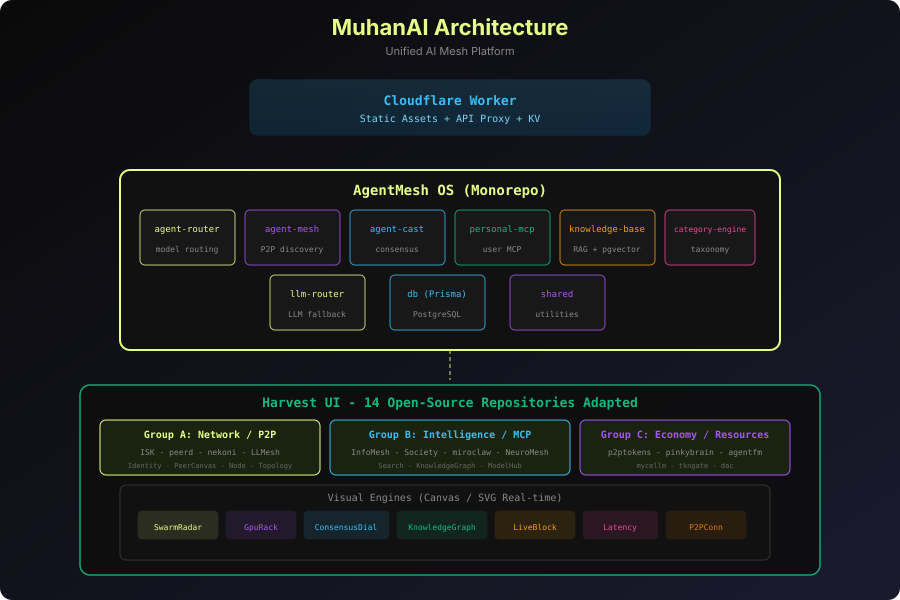

# MuhanAI

**[English](README.md)** | **[한국어](README_ko.md)** | **[中文](README_zh-CN.md)**

MuhanAI es una **plataforma unificada de malla de IA** que combina agentes descentralizados, herramientas MCP personales, grafos de conocimiento, uso compartido de cómputo y una economía de tokens en una experiencia web coherente.

## Stack Tecnológico

- **Frontend**: React 19 + Vite + Tailwind CSS v4
- **Runtime de escritorio**: Electron + Playwright
- **Framework de agentes**: AgentMesh OS monorepo (pnpm workspaces)
- **Backend**: Cloudflare Workers + KV
- **Base de datos**: Prisma + PostgreSQL + pgvector
- **Caché**: Redis
- **Lenguaje**: TypeScript 5.x

## Arquitectura



```
muhanai.com
├── Cloudflare Worker (static assets + API proxy)
├── AgentMesh OS (monorepo)
│   ├── agent-router      → model/provider routing
│   ├── agent-mesh        → P2P agent discovery
│   ├── agent-cast        → multi-agent consensus
│   ├── personal-mcp      → user-owned MCP servers
│   ├── knowledge-base    → hybrid search + RAG
│   ├── category-engine   → taxonomy + jurisdiction
│   └── llm-router        → multi-LLM fallback
└── Harvest UI (14 open-source repos adapted)
    ├── A: ISK / peerd / nekoni / LLMesh
    ├── B: InfoMesh / Society / miroclaw / NeuroMesh
    └── C: p2ptokens / pinkybrain / agentfm / mycellm / tkngate / dac
```

## Características Principales

- **Panel de 27 menús** — Network, Intelligence, Marketplace, Economy, Workspace, System
- **Agent Mesh** — descubrimiento A2A descentralizado e identidad
- **Knowledge Graph** — lienzo SVG + búsqueda híbrida + procedencia
- **Agent Cast** — línea de tiempo de consenso multi-agente
- **MCP Skills** — UI de ejecución de herramientas
- **Model Hub** — gestión de modelos locales HuggingFace/Ollama
- **Marketplace** — Agents, Human Experts, MCP, Knowledge, Compute
- **Token Economy** — contribuciones, reputación, libro mayor, anillo de confianza

## Requisitos Previos

- **Node.js** >= 20
- **pnpm** >= 10
- **PostgreSQL** with pgvector
- **Redis**
- **Chrome/Chromium**

## Inicio Rápido

```bash
pnpm install
docker compose up -d postgres redis
pnpm prisma migrate dev
pnpm generate
pnpm dev:web
pnpm build
pnpm deploy:worker
```

## Licencia

[MIT](LICENSE)
