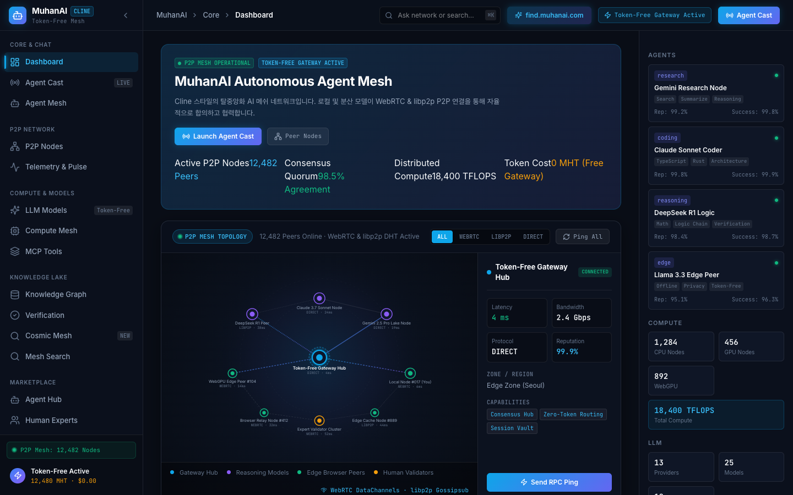

<div align="center">

# 🌌 MuhanAI (무한AI)
### 자율 AI 에이전트 메쉬 & 코스믹 지식 토폴로지 플랫폼

[](https://muhanai.com)
[](https://muhanai.com)
[](https://muhanai.com)
[](https://muhanai.com)
[](LICENSE)

**[English](README.md)** | **[🌌 코스믹 지식 메쉬 (muhanai.com)](https://muhanai.com)** | **[🖥️ 개발자 대시보드 (/dashboard)](https://muhanai.com/dashboard)**

<br />

MuhanAI는 **API 토큰 비용 없는 추론 라우팅(Zero-Token Gateway)**, **WebRTC P2P 기반 CRDT 지식 레이크**, **멀티 에이전트 합의(Consensus)**, 그리고 **전체화면 우주 실루엣의 옵시디언 지식 그래프**를 결합한 탈중앙화 집단지성 플랫폼입니다.

</div>

---

## 📸 실제 서비스 화면 프리뷰

### 1. 코스믹 옵시디언 지식 메쉬 (`muhanai.com` 및 `find.muhanai.com`)
> *우주 전체 실루엣을 배경으로 하는 물리 기반 옵시디언 지식 그래프, 실시간 WebRTC 피어 접속 초신성 애니메이션, 상단 중앙 깜박이는 고스트 타이프라이터 옴니바.*

<div align="center">
  
</div>

- **상단 중앙 깜박이는 옴니바**: 타이프라이터 고스트 텍스트(`[[Zero-Token Gateway]]`, `#WebRTC CRDT`)와 깜박이는 네온 커서(`▋`)로 유저의 입력을 유도하며 `Enter` 시 우주 공간에 즉시 새 노드 발행.
- **초신성 충격파(Shockwave) & 사운드**: 새로운 피어가 접속하거나 노드가 발행될 때 Web Audio API 합성 크리스탈 차임음과 초신성 충격파 파동 방출.
- **옵시디언 마크다운 인스펙터**: YAML Frontmatter, 클릭 가능한 `[[WikiLinks]]`, 양방향 백링크, 피어 출처 배지가 포함된 우측 슬라이드 뷰어.

<br />

### 2. 개발자 콘솔 대시보드 (`muhanai.com/dashboard`)
> *단일 대시보드 화면에 완전히 통합된 한국형 지식인(Knowledge IN) 집단지성 피드 및 실시간 P2P 텔레메트리.*

<div align="center">
  
</div>

- **Ask Network (네트워크 질문하기)**: 다중 LLM 피어 쿼럼에게 즉각적인 지식 캐스트 질문 발송.
- **도움이 필요한 질문 & 미해결 과제**: 실제 현장 경험 격차 및 AI가 풀지 못한 난제를 인간 전문가와 에이전트가 함께 해결.
- **인기 급상승 질문 & 팩트체크 검증**: 실시간 집단지성 크로스 검증 및 MHT 평판 크레딧 보상 획득.
- **P2P 텔레메트리**: 실시간 네트워크 텔레메트리 및 응답 지연 시간 모니터링.

---

## 🏛️ 시스템 아키텍처

<div align="center">
  
</div>

```
muhanai.com / find.muhanai.com
├── Cloudflare Workers Edge (정적 에셋 서빙 + KV 피드 + 웹소켓 프록시)
├── WebRTC DataChannel P2P Mesh (클라이언트 간 제로 홉 CRDT 지식 샤드 동기화)
├── AgentMesh OS 모노레포
│   ├── agent-router      → 로컬 WebGPU 및 클라우드 모델 프로바이더 자율 분기
│   ├── agent-mesh        → 분산 A2A 탐색 및 DID 검증
│   ├── agent-cast        → 멀티 에이전트 가중 투표 합의 스트림
│   ├── personal-mcp      → 사용자 소유 MCP(Model Context Protocol) 도구 그리드
│   ├── knowledge-base    → 하이브리드 시맨틱 검색 (BGE-M3 + pgvector)
│   └── category-engine   → 자율 분류체계 및 지식 검증 관할 시스템
└── UI 레이어
    ├── /find             → 전체화면 코스믹 옵시디언 지식 그래프 캔버스
    ├── /agent-cast       → 합의 타임라인 및 실시간 다중 에이전트 브로드캐스트
    ├── /p2p-network      → 인터랙티브 피어 레이턴시 토폴로지 및 노드 인스펙터
    └── /marketplace      → 에이전트, 인간 전문가, MCP 도구, 컴퓨팅 마켓
```

---

## ✨ 핵심 차별점

| 영역 | 기능 상세 |
|:---|:---|
| 🌌 **코스믹 지식 토폴로지** | 100vw/100vh HTML5 Canvas 천체 성운 및 물리 기반 시뮬레이션(반발력, 탄성력, 중력)과 옵시디언 `[[위키링크]]` 지원. |
| ⚡ **제로 토큰 게이트웨이** | 브라우저 로컬 WebGPU 실행과 P2P 릴레이를 결합하여 중앙 API 비용 없는 자율 추론 달성. |
| 📡 **멀티 에이전트 캐스트** | Claude 3.7 Sonnet, DeepSeek R1 Quorum, Gemini 2.5 Pro 간의 실시간 토론 및 가중 합의 도출. |
| 📚 **통합 지식인(Knowledge IN)** | 도움이 필요한 질문, 팩트체크 검증, 인간 지식 수배, AI 가르치기 등 실전 피드 대시보드 단일 통합. |
| 🔌 **MCP 도구 생태계** | Anthropic 표준 Model Context Protocol 지원으로 로컬 브라우저에서 외부 툴 및 데이터베이스 안전 연동. |
| 🪙 **토큰 프리 경제** | 신용카드 결제창 없이, 검증된 지식 기여와 컴퓨팅 공유 평판에 기반한 탈중앙 크레딧 시스템. |

---

## 🚀 빠른 시작 가이드

### 1. 사전 요구사항
- **Node.js**: `>= 20.0.0`
- **pnpm**: `>= 9.0.0`

### 2. 저장소 복제 및 의존성 설치
```bash
# 저장소 복제
git clone https://github.com/koraussie7/muhanai.git
cd muhanai

# 전체 모노레포 패키지 설치
pnpm install
```

### 3. 로컬 개발 서버 실행
```bash
cd packaging/npm/token-free-gateway/agentmesh
pnpm --filter @agentmesh/web dev
```
브라우저에서 [http://localhost:5173](http://localhost:5173) 으로 접속합니다.

### 4. 타입 검사 및 프로덕션 빌드
```bash
# 엄격한 TypeScript 타입 검사
pnpm --filter @agentmesh/web run typecheck

# Vite 프로덕션 빌드
pnpm --filter @agentmesh/web run build
```

### 5. Cloudflare Workers 글로벌 엣지 배포
```bash
cd packaging/npm/token-free-gateway/agentmesh
npx wrangler deploy
```

---

## 📂 프로젝트 구조

```
muhanai/
├── docs/
│   └── images/
│       ├── architecture.svg          # 시스템 아키텍처 다이어그램
│       ├── cosmic-mesh-preview.png   # find.muhanai.com 코스믹 UI 캡처
│       └── dashboard-preview.png     # muhanai.com 개발자 대시보드 캡처
├── packaging/npm/token-free-gateway/agentmesh/
│   ├── apps/
│   │   └── web/                      # React 19 + Vite 프론트엔드
│   │       ├── src/
│   │       │   ├── components/
│   │       │   │   ├── find/         # 코스믹 옵시디언 캔버스 & 옴니바
│   │       │   │   │   ├── CosmicCanvas.tsx
│   │       │   │   │   ├── CosmicPromptBar.tsx
│   │       │   │   │   ├── ObsidianInspector.tsx
│   │       │   │   │   └── FindPage.tsx
│   │       │   │   ├── Dashboard.tsx # 통합 지식인 UI 대시보드
│   │       │   │   ├── Sidebar.tsx   # 깔끔한 개발자 콘솔 사이드바
│   │       │   │   └── AgentCast.tsx # 멀티 에이전트 합의 스트림
│   │       │   └── App.tsx           # 라우팅 및 find.muhanai.com 서브도메인 감지
│   │   └── dist/                     # 빌드된 정적 에셋
│   ├── deploy/
│   │   └── worker.ts                 # Cloudflare Edge Worker 라우터
│   └── wrangler.toml                 # 배포 환경 설정
├── README.md                         # 영문 리드미
└── README_ko.md                      # 국문 리드미
```

---


---

## 👥 기여자 (Contributors)

- **Brian Y** ([@koraussie7](https://github.com/koraussie7)) — 설계 및 총괄 아키텍트
- **Claude 3.7 Sonnet** (`claude@anthropic.com`) — 시스템 아키텍처 및 CRDT 지식 레이크
- **Gemini 2.5 Pro** (`gemini@google.com`) — 그라운딩 검증 및 페디버스(ActivityPub) 브릿지

자세한 내용은 [CONTRIBUTORS.md](CONTRIBUTORS.md)를 참고하세요.

## 📄 라이선스

본 프로젝트는 **MIT License**에 따라 배포됩니다.
